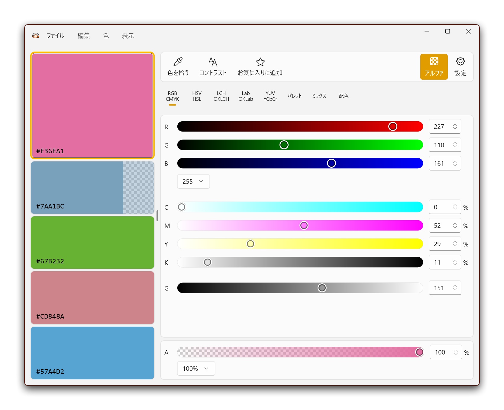
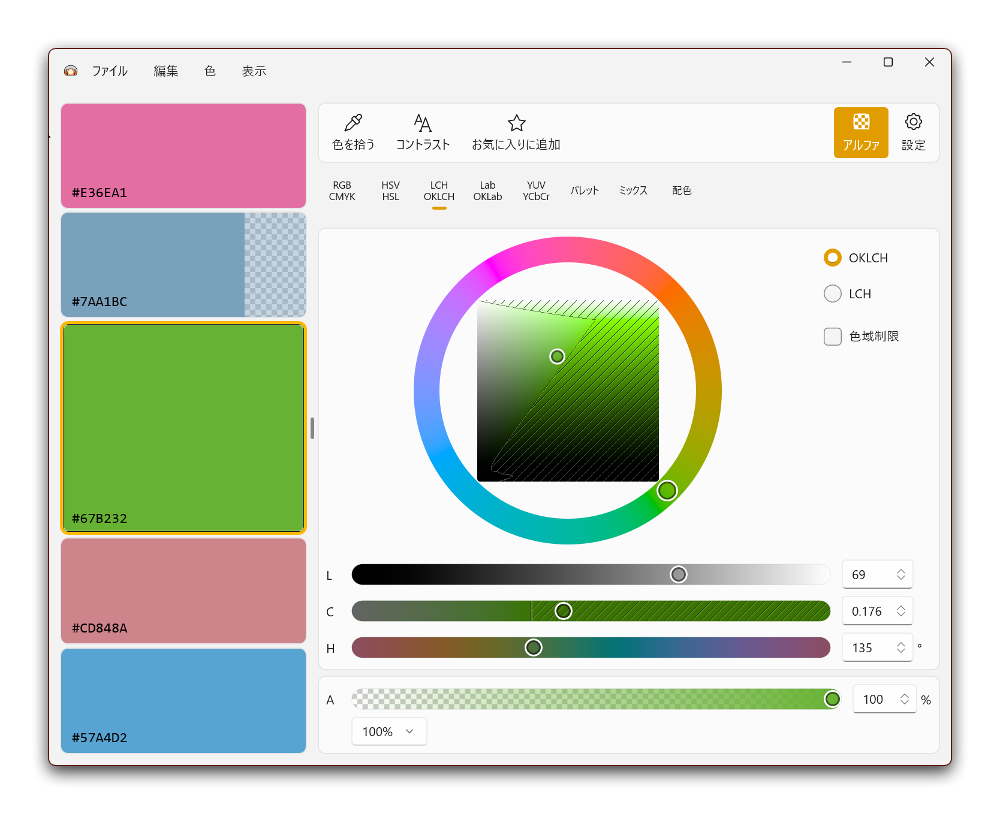
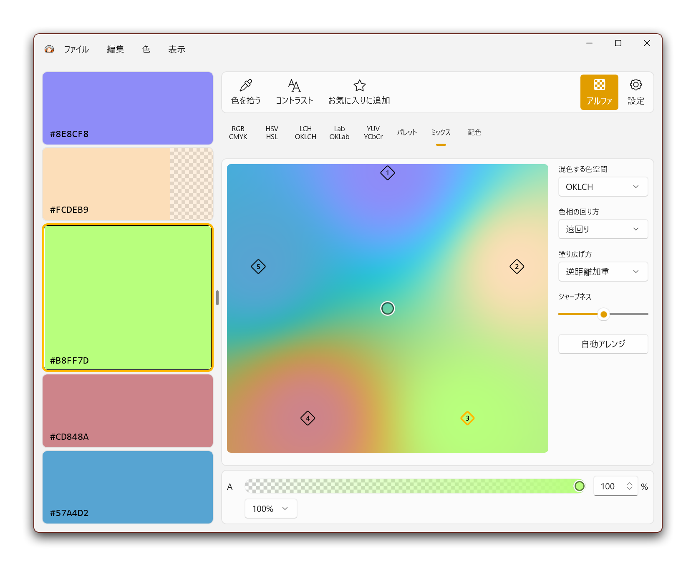
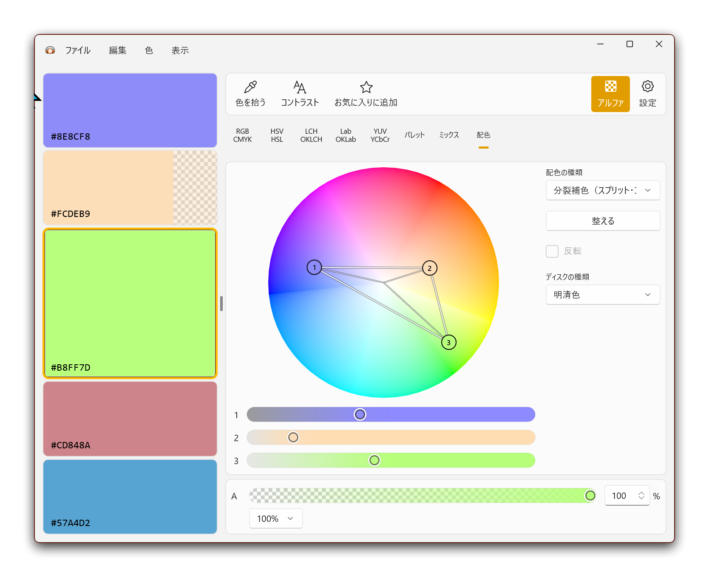

# Irozukume

> 🌐 **[日本語 README →](README.ja.md)**

A system-tray-resident color creation tool and color picker. Build colors across a wide range of color models, create simple color schemes, and pick colors from anywhere on your desktop. It also includes a text contrast checker based on the WCAG guidelines.

There used to be similar freeware way back; this aims to be a modern take on it.

> **This is a seriously alpha build.** Please consider it barely functional for now.

## Screenshots

*Supports the fundamental color models — RGB, CMYK, HSV, HSL, YUV, and more*

*Modern color models such as LCH, LAB, and HWB are on board too*

*Place your colors wherever you like and pick new ones from the resulting gradient*

*Classic harmony tools as well: complementary, split-complementary, triadic, and others*

## Download

Grab the zip from the [latest release](https://github.com/Romly-Romly/irozukume/releases/latest).

- **Portable** — `Irozukume-x64-v*.zip` (64-bit / x64)

Just extract it and run `Irozukume.exe`. No need to install the .NET runtime or anything else in advance (it is bundled with the app).

Because the app is not code-signed, Windows SmartScreen will warn you on first launch. Click "More info" and choose "Run anyway" to start it. Use at your own risk.

## How to Use

TODO: write the how-to section

It shouldn't be all that complicated, so just poke around and try things out…

## Settings

### Where settings are stored

Settings are saved as `settings.json` **in the same folder as the executable**. To wipe your settings, simply delete this `settings.json`.

## System Requirements

| OS | Version |
|---|---|
| Windows | 10 version 2004 (build 19041) or later / 11, 64-bit (x64) |

Windows 10 version 2004 or later is required due to the screen-capture APIs used. The alpha is provided for x64 only. Picking colors from some applications also requires running the app as administrator.

## License

[GNU General Public License version 3](LICENSE) (GPL-3.0)

Copyright (C) 2026 Romly

This program is free software. Under the GPL-3 you may redistribute and modify it. If you distribute a modified version, you must release its source code under the same GPL-3.0.

For the licenses of the third-party software bundled with the app, see [THIRD-PARTY-NOTICES.md](THIRD-PARTY-NOTICES.md).
